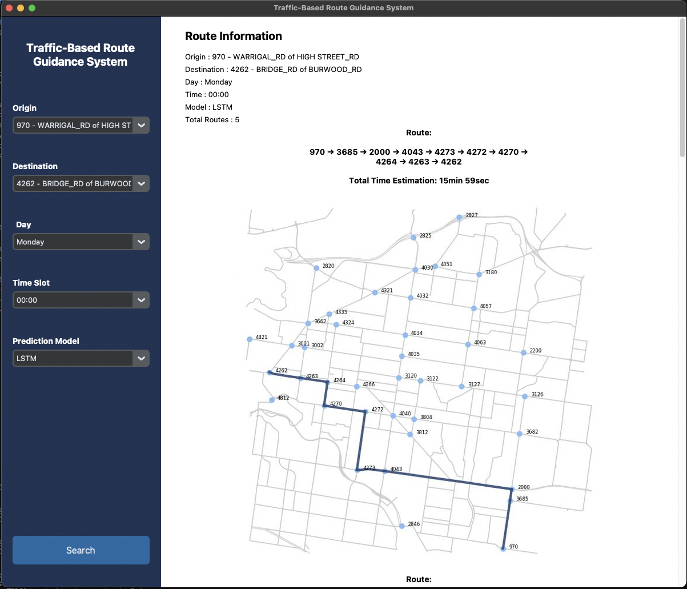
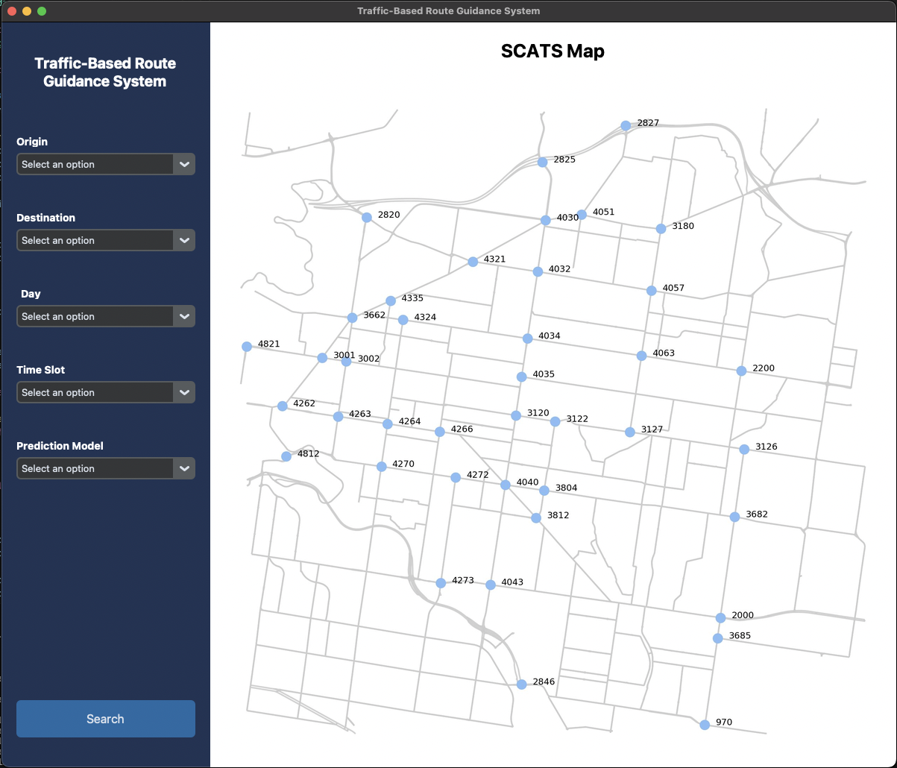

# Traffic-Based Route Guidance System (TBRGS)

**COS30019 – Intelligent Systems Assignment 2B**  
Team ID: Group 3

## 🧠 Project Overview

This project implements a **Traffic-Based Route Guidance System (TBRGS)** that uses machine learning models to forecast traffic volumes and estimate optimal travel paths through the City of Boroondara. By combining predictive modeling with graph search algorithms, the system dynamically guides users through the most efficient routes based on expected traffic conditions.

This system builds upon the foundational work from Assignment 2A and extends it with:
- Multiple time-series machine learning models (LSTM, GRU, and a simple RNN)
- Dynamic prediction of future traffic volume
- Travel time estimation based on predicted traffic
- A top-k shortest path route finder
- A user-friendly graphical interface for real-time interaction

---

## 📁 Project Structure

```
IntroToAI-Assignment-2B/
│
├── DataSet/                          # 📂 Raw and/or processed SCATS traffic data
├── Resources/                        # 📂 Project resources like images, diagrams, or documentation
│
├── TBRGS/                            # 📂 Main application package
│   ├── data/                         # 📂 Data used or generated internally
│   ├── notebooks/                    # 📂 Jupyter notebooks for experiments or analysis
│   └── src/                          # 📂 Source code
│       ├── algorithms/
│       │   └── yens_algorithm.py     # 🔁 Yen’s algorithm implementation for k-shortest paths
│       │
│       ├── gui/
│       │   ├── route_maps/           # 🗺️ Saved route map visualizations for cache
│       │   ├── dashboard.py          # 🖥️ Main dashboard UI logic (likely for traffic insights)
│       │   ├── loading_gif.gif       # 🔄 Animated loading graphic
│       │   ├── map.jpg               # 🗺️ Background or route map image
│       │   └── route_generator.py    # 📍 Route creation logic for pathfinding
│       │
│       ├── models/
│       │   ├── GRU_model/
│       │   │   ├── models/           # 🤖 Saved GRU model files (.keras)
│       │   │   └── scalers/          # 📊 Scalers used to normalize GRU model input/output
│       │   │
│       │   ├── LSTM_model/
│       │   │   ├── models/           # 🤖 Saved LSTM model files (.keras)
│       │   │   └── scalers/          # 📊 Scalers used to normalize LSTM model input/output
│       │   │
│       │   ├── RNN_model/
│       │   │   ├── models/           # 🤖 Saved RNN model files (.keras)
│       │   │   └── scalers/          # 📊 Scalers used to normalize RNN model input/output
│       │   │
│       │   ├── GRU_model.py          # 🧠 GRU model prediction logic
│       │   ├── LSTM_model.py         # 🧠 LSTM model prediction logic
│       │   └── RNN_model.py          # 🧠 RNN model prediction logic
│       │
│       ├── data_processing.py        # 🧹 SCATS data preprocessing (cleaning, transforming)
│       ├── graph.py                  # 🕸️ Graph construction from SCATS intersections
│       ├── main.py                   # 🚦 Main entry point or integration script
│       └── travel_time_estimator.py  # ⏱️ Travel time calculation logic using ML models
│
├── tests/
│   ├── test_graph.py                 # ✅ Unit tests for graph construction
│   └── test_main.py                  # ✅ Unit tests for ML models and travel time estimation
│
├── .gitignore                        # 🙈 Files and folders to exclude from Git
├── LICENSE                           # 📄 Project license
├── README.md                         # 📘 Project overview, setup, usage instructions
└── requirements.txt                  # 📦 Python dependencies list

```

---

## 📊 Machine Learning Models

We implemented and compared the following time-series models:

- **LSTM (Long Short-Term Memory):** RNN variant effective for sequence prediction.
- **GRU (Gated Recurrent Unit):** Lightweight alternative to LSTM with fewer parameters.
- **[Third Model, e.g., Random Forest Regressor or Transformer]:** Chosen for baseline or hybrid performance.

Each model was trained on traffic volume data recorded from sensors across Boroondara in October 2006, predicting volume at 15-minute intervals for future times.

---

## 🧮 How It Works

### 1. **Data Preprocessing**
   - Load and clean time-series traffic sensor data
   - Normalize and reshape for training ML models

### 2. **Traffic Forecasting**
   - Train LSTM, GRU, and another model on historical data
   - Predict traffic volume for user-selected future times

### 3. **Travel Time Estimation**
   - Translate predicted volume into travel time using a regression-based mapping formula

### 4. **Route Finding**
   - Construct a graph where nodes = intersections and edges = road segments
   - Use Dijkstra’s algorithm or A* to calculate **top-k shortest paths** by predicted travel time

### 5. **Graphical User Interface**
   - Users select source, destination, and future time
   - GUI displays top-k recommended paths with estimated travel times and visual overlays

---

## 🚀 Getting Started

### Step 1: Clone the Repository
```bash
git clone 
```

### Step 2: Install Dependencies
Ensure you have Python 3.9+ installed, then:
Make an Anconda environment and install with followings
```bash
pip install -r requirements.txt
```

### Step 3: Launch the App
```bash
python TBRGS/src/main.py
```

This will open the GUI for route prediction and display.

---

## 🧪 Testing

To run all unit and integration tests:
```bash
python -m unittest discover -s tests
```

---

## 📷 Sample Screenshots

> - SCATS map sample

> - Route visualization with top-k paths

> - GUI home screen


---

## 👨‍💻 Team Members

- Yasiru Lokesha  
- Prawud Rathnayake 
- Alex Vrsecky
- Justin Tran

---

## 📄 Final Report

All technical documentation, architecture diagrams, and evaluation metrics are available in:  
📁 `Main Report.pdf`

---

## 📌 Notes

- The dataset used is **City of Boroondara – Traffic Sensor Data (October 2006)**.
- The prediction models rely solely on the provided historical data without external sources.
- GUI developed using [Tkinter / Matplotlib / Networkx] – supports real-time input and route display.
- Graph-based pathfinding uses NetworkX.

---

## 📦 Dependencies

Here are the main Python libraries used:

```text
numpy
pandas
scikit-learn
matplotlib
seaborn
tensorflow
keras
torch
networkx
tkinter
PyQt5
```

All dependencies can be installed with:
```bash
pip install -r requirements.txt
```

---

## 📜 License

This project is submitted for academic purposes only for COS30019.  
All content is original and not intended for commercial or distribution use.

---
